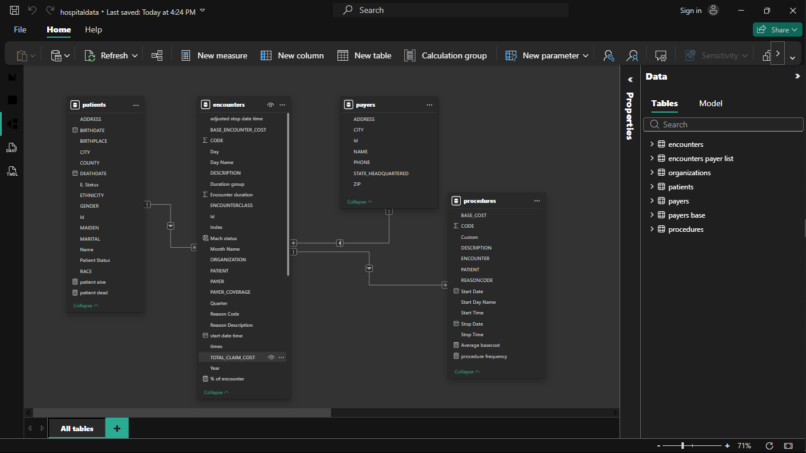

 ## Healthcare Claims & Readmission Analytics (2011–2022)

## Project Overview:

This project analyzes healthcare claims data from 2011 to 2022 to identify cost drivers, patient utilization patterns, payer contributions, and operational trends using Power BI.

The workflow includes data cleaning with Power Query, relational data modeling with enforced referential integrity, and DAX-based KPI development to generate executive-level insights.

## Executive Summary:

Between 2011 and 2022:

Total Visits: 28K

Total Claim Cost: $102M

Active Patients: 820

Deceased Patients: 154

Uninsured Rate: 48.71%

Uninsured Patients: 14K

## Key Observations:

Healthcare costs are highly concentrated among a small group of patients, with the top contributors accounting for a significant portion of total claims.

Medicare and Medicaid represent the largest share of total claim cost.

Over 97% of encounters are under 24 hours, indicating a high volume of short-duration care.

Nearly half of patients are uninsured, posing potential financial sustainability risks.

Claim costs fluctuate across years, with noticeable peaks suggesting variations in case complexity or patient volume.

## Recommendations:

1. Implement targeted care management programs for high-cost patients to reduce repeat high-expense encounters.

2. Monitor payer dependency and reimbursement exposure, particularly from public insurance programs.

3. Develop strategies to reduce uninsured patient impact and improve revenue stability.

4. Evaluate procedure cost-to-frequency relationships to optimize operational efficiency.

5. Introduce predictive monitoring dashboards to detect abnormal cost spikes early.

## Data Modeling:

Fact Table: Encounters

Dimension Tables: Patients, Payers, Procedures, Organizations

One-to-many relationships enforced

Referential integrity maintained

Time intelligence analysis (Year, Quarter, Month)

Tools & Techniques Used

Power BI

Power Query (Data Cleaning & Transformation)

DAX Measures (Financial & KPI Metrics)

Relational Data Modeling

Time Intelligence

## Dashboard Preview
  

## Data Model View
   
